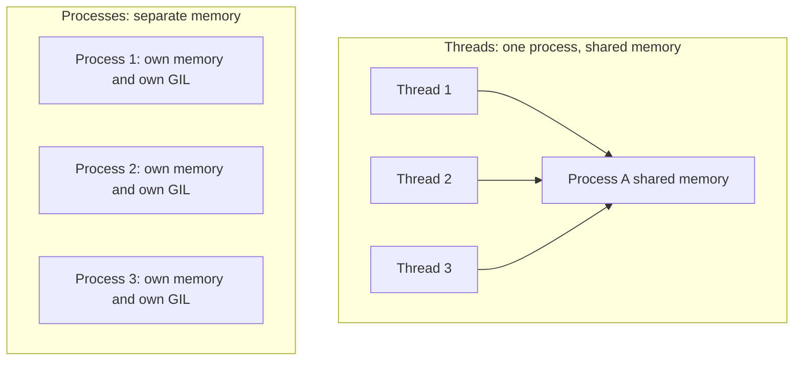
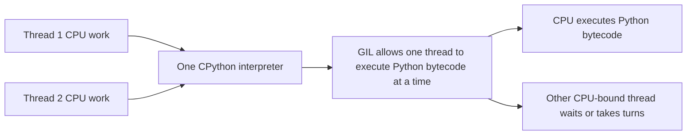

# Python Multithreading, Multiprocessing and GIL — Study Material with Built-In Diagrams

> **Important Fix:** The previous Markdown file used image links like `diagram_gil_cpu_bound.png`. Those images may not display if the PNG files are not in the same folder as the `.md` file.  
> This fixed version does **not depend on external image files**. The diagrams are written directly inside the Markdown file using **Mermaid diagrams** and **text fallback diagrams**.

---

# Python Multithreading, Multiprocessing and GIL — Study Material with Code Examples

## 1. What are Threads?

A **thread** is a small unit of execution inside a process.

In simple words:

> A thread allows a program to do multiple tasks at the same time, or at least appear to do them at the same time.

Example:

- Playing music
- Downloading a file
- Updating score in a game
- Handling user input
- Showing animation

All these tasks can run concurrently using threads.

---

## 2. Real-World Example of Threads

Think about using a mobile phone.

You may be:

- Talking on a call
- Checking cricket score
- Opening WhatsApp
- Receiving notifications

All these things appear to happen at the same time.

Similarly, in a game like Mario:

- Player is moving
- Enemy is moving
- Music is playing
- Score is updating

If all these tasks happened one by one, the game would freeze again and again.

Threads help us run such tasks concurrently.

---

# 3. Normal Program Execution Without Threads

Let us start with a simple example.

We have two classes:

- `Hello`
- `Hi`

Each class prints a message 5 times.

```python
class Hello:
    def do(self):
        for i in range(5):
            print("Hello", i + 1)


class Hi:
    def do(self):
        for i in range(5):
            print("Hi", i + 1)


obj1 = Hello()
obj2 = Hi()

obj1.do()
obj2.do()
```

## Output

```text
Hello 1
Hello 2
Hello 3
Hello 4
Hello 5
Hi 1
Hi 2
Hi 3
Hi 4
Hi 5
```

## Explanation

Python executes code line by line.

First this runs completely:

```python
obj1.do()
```

Then this runs:

```python
obj2.do()
```

So first all `Hello` messages are printed, then all `Hi` messages are printed.

But now suppose we want both functions to run together.

For that, we use **threads**.

---

# 4. Class-Level Multithreading

To create threads using classes, we inherit from the `Thread` class.

```python
from threading import Thread


class Hello(Thread):
    def run(self):
        for i in range(5):
            print("Hello", i + 1)


class Hi(Thread):
    def run(self):
        for i in range(5):
            print("Hi", i + 1)


t1 = Hello()
t2 = Hi()

t1.start()
t2.start()
```

## Possible Output

```text
Hello 1
Hello 2
Hi 1
Hello 3
Hi 2
Hello 4
Hi 3
Hi 4
Hello 5
Hi 5
```

The exact output may be different every time.

## Important Points

When using class-level threading:

1. Inherit from `Thread`.
2. Define a method named `run()`.
3. Create objects of the thread classes.
4. Call `start()`, not `run()`.

Example:

```python
t1.start()
```

Internally, `start()` calls the `run()` method.

## Why Not Call `run()` Directly?

If we call:

```python
t1.run()
t2.run()
```

then the methods execute normally one after another.

But if we call:

```python
t1.start()
t2.start()
```

then Python creates separate threads and runs them concurrently.

---

# 5. Adding Delay Using `sleep()`

Sometimes output happens too fast, so we can add a small delay.

```python
from threading import Thread
from time import sleep


class Hello(Thread):
    def run(self):
        for i in range(5):
            print("Hello", i + 1)
            sleep(0.3)


class Hi(Thread):
    def run(self):
        for i in range(5):
            print("Hi", i + 1)
            sleep(0.3)


t1 = Hello()
t2 = Hi()

t1.start()
t2.start()
```

## Possible Output

```text
Hello 1
Hi 1
Hello 2
Hi 2
Hello 3
Hi 3
Hello 4
Hi 4
Hello 5
Hi 5
```

## Note

The order is not always guaranteed.

The operating system scheduler decides which thread gets CPU time.

---

# 6. Thread Scheduling

When multiple threads are running, we may think:

> First thread 1 runs, then thread 2 runs, then thread 1 runs again.

But this is not guaranteed.

The **scheduler** decides which thread gets a chance to execute.

The output depends on:

- CPU speed
- Operating system
- Other running applications
- Thread timing
- Python interpreter behavior

So we should not depend on exact thread execution order.

---

# 7. Function-Level Multithreading

The more Pythonic way is often to create threads using functions.

Instead of creating classes, we create normal functions.

```python
from threading import Thread
from time import sleep


def hello():
    for i in range(5):
        print("Hello", i + 1)
        sleep(0.3)


def hi():
    for i in range(5):
        print("Hi", i + 1)
        sleep(0.3)


t1 = Thread(target=hello)
t2 = Thread(target=hi)

t1.start()
t2.start()
```

## Possible Output

```text
Hello 1
Hi 1
Hello 2
Hi 2
Hello 3
Hi 3
Hello 4
Hi 4
Hello 5
Hi 5
```

## Explanation

Here:

```python
t1 = Thread(target=hello)
```

means:

> Create a thread that will execute the `hello()` function.

And:

```python
t2 = Thread(target=hi)
```

means:

> Create a thread that will execute the `hi()` function.

We start the threads using:

```python
t1.start()
t2.start()
```

---

# 8. Understanding `join()`

Now let us add one more line:

```python
print("Bye")
```

Example:

```python
from threading import Thread
from time import sleep


def hello():
    for i in range(5):
        print("Hello", i + 1)
        sleep(0.3)


def hi():
    for i in range(5):
        print("Hi", i + 1)
        sleep(0.3)


t1 = Thread(target=hello)
t2 = Thread(target=hi)

t1.start()
t2.start()

print("Bye")
```

## Possible Output

```text
Hello 1
Hi 1
Bye
Hello 2
Hi 2
Hello 3
Hi 3
Hello 4
Hi 4
Hello 5
Hi 5
```

## Why does `Bye` print in the middle?

Because the main thread does not wait for `t1` and `t2` to finish.

The main thread starts both threads and immediately continues to the next line:

```python
print("Bye")
```

## Using `join()`

To make the main thread wait, we use `join()`.

```python
from threading import Thread
from time import sleep


def hello():
    for i in range(5):
        print("Hello", i + 1)
        sleep(0.3)


def hi():
    for i in range(5):
        print("Hi", i + 1)
        sleep(0.3)


t1 = Thread(target=hello)
t2 = Thread(target=hi)

t1.start()
t2.start()

t1.join()
t2.join()

print("Bye")
```

## Output

```text
Hello 1
Hi 1
Hello 2
Hi 2
Hello 3
Hi 3
Hello 4
Hi 4
Hello 5
Hi 5
Bye
```

## Explanation

These lines:

```python
t1.join()
t2.join()
```

tell the main thread:

> Wait until `t1` and `t2` complete their work.

Only after both threads complete, `Bye` is printed.

---

# 9. Practical Example: File Download Simulation

Threads are very useful for **I/O-bound operations**.

I/O-bound tasks include:

- Downloading files
- Reading files
- Writing files
- Calling APIs
- Database operations
- Network requests

Let us simulate file downloading.

## Serial Execution

```python
from time import sleep, time


def download(file_name):
    print(f"Downloading file: {file_name}")
    sleep(0.5)
    print(f"Download complete: {file_name}")


files = ["video.mp4", "image.png", "data.csv"]

start = time()

for file in files:
    download(file)

end = time()

print(f"Serial time: {end - start:.2f} seconds")
print("Bye")
```

## Output

```text
Downloading file: video.mp4
Download complete: video.mp4
Downloading file: image.png
Download complete: image.png
Downloading file: data.csv
Download complete: data.csv
Serial time: 1.50 seconds
Bye
```

## Explanation

Each file takes `0.5` seconds.

There are 3 files.

So total time is around:

```text
0.5 + 0.5 + 0.5 = 1.5 seconds
```

---

# 10. Same Example Using Multithreading

Now let us download all files concurrently.

```python
from threading import Thread
from time import sleep, time


def download(file_name):
    print(f"Downloading file: {file_name}")
    sleep(0.5)
    print(f"Download complete: {file_name}")


files = ["video.mp4", "image.png", "data.csv"]

threads = []

start = time()

for file in files:
    t = Thread(target=download, args=(file,))
    threads.append(t)
    t.start()

for t in threads:
    t.join()

end = time()

print(f"Multithreading time: {end - start:.2f} seconds")
print("Bye")
```

## Output

```text
Downloading file: video.mp4
Downloading file: image.png
Downloading file: data.csv
Download complete: video.mp4
Download complete: image.png
Download complete: data.csv
Multithreading time: 0.50 seconds
Bye
```

## Explanation

All three downloads start almost together.

Each download takes `0.5` seconds.

So total time becomes around:

```text
0.5 seconds
```

instead of:

```text
1.5 seconds
```

This is why threads are useful for I/O-bound tasks.

---

# 11. Passing Arguments to Threads

When a function needs arguments, we pass them using `args`.

```python
t = Thread(target=download, args=(file,))
```

Important:

```python
args=(file,)
```

The comma is required because `args` expects a tuple.

If we write:

```python
args=(file)
```

that is not treated as a tuple.

Correct:

```python
args=(file,)
```

---

# 12. What is Multiprocessing?

A **process** is an independent program execution unit.

A process has:

- Its own memory
- Its own Python interpreter
- Its own resources
- Its own Global Interpreter Lock in CPython

Threads are lightweight and share memory.

Processes are heavier but more independent.

---

# 13. Multithreading vs Multiprocessing

## Multithreading

In multithreading:

- Multiple threads run inside the same process.
- Threads share memory.
- Threads are lightweight.
- Thread creation is faster.
- Best for I/O-bound tasks.
- Affected by GIL for CPU-heavy Python code.

## Multiprocessing

In multiprocessing:

- Multiple processes run independently.
- Each process has its own memory.
- Process creation is slower than thread creation.
- Uses more memory.
- Best for CPU-bound tasks.
- Can use multiple CPU cores effectively.

---

# 14. CPU-Bound Example

A CPU-bound task is a task that needs heavy calculation.

Example:

> Find the sum of squares from 0 to 50 million.

```python
from time import time


def calculate(start_num, end_num):
    total = 0
    for n in range(start_num, end_num):
        total += n * n
    return total


num = 50_000_000

start = time()

calculate(0, num)

end = time()

print(f"Serial time: {end - start:.2f} seconds")
```

## Explanation

This code performs many calculations.

This is CPU-heavy work.

---

# 15. CPU-Bound Task Using Threads

Now let us divide the work into two threads.

```python
from threading import Thread
from time import time


def calculate(start_num, end_num):
    total = 0
    for n in range(start_num, end_num):
        total += n * n


num = 50_000_000
mid = num // 2

start = time()

t1 = Thread(target=calculate, args=(0, mid))
t2 = Thread(target=calculate, args=(mid, num))

t1.start()
t2.start()

t1.join()
t2.join()

end = time()

print(f"Threading time: {end - start:.2f} seconds")
```

## Expected Observation

You may expect this to become twice as fast.

But usually it does not become much faster for CPU-bound Python code.

Sometimes it may even be slower.

Why?

Because of the **GIL**.

---

# 16. What is GIL?

GIL stands for:

> Global Interpreter Lock

In CPython, the GIL allows only one thread to execute Python bytecode at a time.

That means if two Python threads are doing CPU-heavy work, they cannot truly execute Python code in parallel on multiple CPU cores.

So for CPU-heavy Python code:

```python
Thread 1
Thread 2
```

do not fully run in parallel.

They take turns.

This thread switching also has overhead.

That is why multithreading is not very useful for CPU-bound Python tasks.

---

# 17. Multiprocessing for CPU-Bound Task

To improve CPU-bound performance, we can use multiprocessing.

```python
from multiprocessing import Process
from time import time


def calculate(start_num, end_num):
    total = 0
    for n in range(start_num, end_num):
        total += n * n


if __name__ == "__main__":
    num = 50_000_000
    mid = num // 2

    start = time()

    p1 = Process(target=calculate, args=(0, mid))
    p2 = Process(target=calculate, args=(mid, num))

    p1.start()
    p2.start()

    p1.join()
    p2.join()

    end = time()

    print(f"Multiprocessing time: {end - start:.2f} seconds")
```

## Explanation

Here we create two processes:

```python
p1 = Process(target=calculate, args=(0, mid))
p2 = Process(target=calculate, args=(mid, num))
```

Each process runs independently.

Each process has its own Python interpreter and its own GIL.

So multiprocessing can use multiple CPU cores better.

## Important Note

When using multiprocessing, always use:

```python
if __name__ == "__main__":
```

This is especially important on Windows and also a good practice in general.

---

# 18. Complete Comparison Example

This example compares:

1. Serial execution
2. Multithreading
3. Multiprocessing

```python
from threading import Thread
from multiprocessing import Process
from time import time


def calculate(start_num, end_num):
    total = 0
    for n in range(start_num, end_num):
        total += n * n


if __name__ == "__main__":
    num = 50_000_000
    mid = num // 2

    # Serial execution
    start = time()
    calculate(0, num)
    end = time()
    print(f"Serial time: {end - start:.2f} seconds")

    # Multithreading
    start = time()

    t1 = Thread(target=calculate, args=(0, mid))
    t2 = Thread(target=calculate, args=(mid, num))

    t1.start()
    t2.start()

    t1.join()
    t2.join()

    end = time()
    print(f"Multithreading time: {end - start:.2f} seconds")

    # Multiprocessing
    start = time()

    p1 = Process(target=calculate, args=(0, mid))
    p2 = Process(target=calculate, args=(mid, num))

    p1.start()
    p2.start()

    p1.join()
    p2.join()

    end = time()
    print(f"Multiprocessing time: {end - start:.2f} seconds")
```

## Possible Output

```text
Serial time: 2.10 seconds
Multithreading time: 2.20 seconds
Multiprocessing time: 1.15 seconds
```

The exact time depends on your system.

---

# 19. When to Use Multithreading?

Use multithreading when the task spends time waiting.

Examples:

- Downloading files
- Reading files
- Writing files
- API calls
- Database calls
- Network requests
- Web scraping
- Background tasks

These are called **I/O-bound tasks**.

Example:

```python
from threading import Thread
from time import sleep


def send_email(user):
    print(f"Sending email to {user}")
    sleep(1)
    print(f"Email sent to {user}")


users = ["Amit", "Priya", "Rahul"]

threads = []

for user in users:
    t = Thread(target=send_email, args=(user,))
    threads.append(t)
    t.start()

for t in threads:
    t.join()

print("All emails sent")
```

---

# 20. When to Use Multiprocessing?

Use multiprocessing when the task needs heavy CPU calculation.

Examples:

- Image processing
- Video processing
- Data processing
- Mathematical calculations
- Machine learning preprocessing
- Large loops
- Compression
- Encryption

These are called **CPU-bound tasks**.

Example:

```python
from multiprocessing import Process


def process_data(start, end):
    total = 0
    for i in range(start, end):
        total += i * i
    print("Processing completed")


if __name__ == "__main__":
    p1 = Process(target=process_data, args=(0, 10_000_000))
    p2 = Process(target=process_data, args=(10_000_000, 20_000_000))

    p1.start()
    p2.start()

    p1.join()
    p2.join()

    print("All processing completed")
```

---

# 21. Thread Memory vs Process Memory

## Threads

Threads share the same memory.

That means if one thread changes shared data, another thread can see it.

Example:

```python
from threading import Thread


counter = 0


def increase():
    global counter
    for _ in range(100000):
        counter += 1


t1 = Thread(target=increase)
t2 = Thread(target=increase)

t1.start()
t2.start()

t1.join()
t2.join()

print(counter)
```

Since threads share memory, we must be careful when modifying shared variables.

## Processes

Processes do not share memory by default.

Each process has its own memory space.

This makes processes safer in some cases, but communication between processes is more complex.

---

# 22. Important Methods

## `start()`

Starts the thread or process.

```python
t1.start()
```

## `join()`

Waits for the thread or process to finish.

```python
t1.join()
```

## `target`

Specifies the function to execute.

```python
Thread(target=hello)
```

## `args`

Passes arguments to the target function.

```python
Thread(target=download, args=("video.mp4",))
```

---

# 23. Key Points to Remember

1. A thread is a lightweight unit inside a process.
2. Threads are useful for running multiple tasks concurrently.
3. Use `threading.Thread` to create threads.
4. Use `start()` to start a thread.
5. Do not call `run()` directly if you want real threading behavior.
6. Use `join()` to wait for threads to finish.
7. Thread execution order is not guaranteed.
8. Threads are best for I/O-bound tasks.
9. Multiprocessing is best for CPU-bound tasks.
10. GIL limits true parallel execution of CPU-heavy Python threads in CPython.
11. Processes have separate memory.
12. Threads share memory.
13. Processes are heavier than threads.
14. Multiprocessing can use multiple CPU cores better for CPU-heavy tasks.

---

# 24. Final Simple Example

## Multithreading Example

```python
from threading import Thread
from time import sleep


def task1():
    for i in range(3):
        print("Task 1 running")
        sleep(1)


def task2():
    for i in range(3):
        print("Task 2 running")
        sleep(1)


t1 = Thread(target=task1)
t2 = Thread(target=task2)

t1.start()
t2.start()

t1.join()
t2.join()

print("Both tasks completed")
```

## Output

```text
Task 1 running
Task 2 running
Task 1 running
Task 2 running
Task 1 running
Task 2 running
Both tasks completed
```

---

# Final Definition

**Multithreading** in Python means running multiple threads within the same process to perform tasks concurrently.

**Multiprocessing** means running multiple processes independently, each with its own memory and interpreter.

Use:

- **Multithreading** for I/O-bound tasks
- **Multiprocessing** for CPU-bound tasks

In short:

```text
Waiting task  -> Use threading
CPU-heavy task -> Use multiprocessing
```

---

# Additional Explanation with Diagrams

## A. Big Picture: What Problem Do Threads Solve?

In normal Python execution, code runs **step by step**.

Example:

```python
hello()
hi()
```

Python first completes `hello()`, then starts `hi()`.

But with threads, both tasks can start and make progress concurrently.

## Sequential Execution vs Multithreading

### Mermaid Diagram

```mermaid
flowchart LR
    subgraph A[Without threads: sequential execution]
        M1[Main Thread] --> H1[hello() completes first] --> I1[hi() starts after hello]
    end

    subgraph B[With threads: concurrent execution]
        M2[Main Thread] --> T1[Thread 1: hello()]
        M2 --> T2[Thread 2: hi()]
        T1 --> C[Both tasks make progress concurrently]
        T2 --> C
    end
```

### Text Diagram Fallback

```text
Without Threads:
Main Thread --> hello() completes first --> hi() starts after hello

With Threads:
              --> Thread 1: hello() --\
Main Thread --                              --> Both tasks make progress concurrently
              --> Thread 2: hi()     --/
```

### Simple Understanding

Without threads:

```text
hello() finishes fully
then
hi() starts
```

With threads:

```text
hello() starts
hi() starts
both keep running side by side
```

This is useful when tasks spend time waiting, such as:

- Downloading files
- Reading files
- Calling APIs
- Database operations

---

## B. Understanding Main Thread and Worker Threads

Every Python program starts with one main thread.

When we create extra threads, those threads are called **worker threads**.

Example:

```python
from threading import Thread


def hello():
    print("Hello")


def hi():
    print("Hi")


t1 = Thread(target=hello)
t2 = Thread(target=hi)

t1.start()
t2.start()
```

Here:

- Main thread creates `t1`
- Main thread creates `t2`
- `t1` runs `hello()`
- `t2` runs `hi()`

The main thread does not automatically wait for worker threads unless we use `join()`.

---

## C. Why `join()` Is Important

When we start threads, the main thread continues executing the next lines.

So this code:

```python
t1.start()
t2.start()

print("Bye")
```

may print `"Bye"` before `t1` and `t2` finish.

To stop that, we use:

```python
t1.join()
t2.join()
```

## Why join() Is Needed

### Mermaid Diagram

```mermaid
flowchart LR
    M[Main thread starts worker threads] --> T1[t1 running]
    M --> T2[t2 running]
    T1 --> J[Main thread waits using t1.join() and t2.join()]
    T2 --> J
    J --> B[print("Bye")]
```

### Text Diagram Fallback

```text
Main thread starts t1 and t2
        |
        |--> t1 running --\
        |                 --> main waits using join() --> print("Bye")
        |--> t2 running --/
```

### Meaning of `join()`

```python
t1.join()
```

means:

> Main thread, please wait until `t1` completes.

```python
t2.join()
```

means:

> Main thread, please wait until `t2` completes.

So the correct flow becomes:

```text
Start t1
Start t2
Wait for t1
Wait for t2
Then print Bye
```

---

## D. Thread vs Process — Easy Diagram

Threads and processes are different.

A **thread** is lightweight and lives inside a process.

A **process** is heavier and has its own memory.

## Threads vs Processes: Memory Model

### Mermaid Diagram



### Text Diagram Fallback

```text
Threads:
Process A
  Shared Memory
     ^       ^       ^
     |       |       |
 Thread 1 Thread 2 Thread 3

Processes:
Process 1 -> Own Memory + Own GIL
Process 2 -> Own Memory + Own GIL
Process 3 -> Own Memory + Own GIL
```

### Threads

Threads share the same memory.

Example:

```text
Process
 ├── Thread 1
 ├── Thread 2
 └── Thread 3
```

Because threads share memory, communication between threads is easy.

But shared memory can also cause problems if multiple threads update the same data at the same time.

### Processes

Processes have separate memory.

Example:

```text
Process 1 -> Own memory
Process 2 -> Own memory
Process 3 -> Own memory
```

Because each process has its own memory, processes are safer for CPU-heavy work but heavier than threads.

---

## E. Why Threads Are Good for I/O-Bound Tasks

I/O-bound tasks spend most of their time waiting.

Example:

```python
from time import sleep


def download(file_name):
    print("Downloading", file_name)
    sleep(1)
    print("Completed", file_name)
```

Here, `sleep(1)` represents waiting for download.

During this waiting time, another thread can run.

That is why threads are useful for:

```text
Download file 1
Download file 2
Download file 3
```

Instead of waiting like this:

```text
File 1 -> File 2 -> File 3
```

Threads allow:

```text
File 1
File 2
File 3
all start together
```

---

## F. Why Threads Are Not Always Fast for CPU-Bound Tasks

CPU-bound tasks need continuous CPU work.

Example:

```python
def calculate(start, end):
    total = 0
    for n in range(start, end):
        total += n * n
```

This does not wait for file, network, or database.

It continuously uses the CPU.

For this kind of work, Python threads may not improve performance much because of the **GIL**.

---

## G. GIL Diagram

GIL stands for:

```text
Global Interpreter Lock
```

In CPython, the GIL allows only one thread to execute Python bytecode at a time.

## GIL Impact on CPU-Bound Threads

### Mermaid Diagram



### Text Diagram Fallback

```text
Thread 1 CPU work --\
                     --> One CPython Interpreter --> GIL --> One thread executes Python bytecode at a time
Thread 2 CPU work --/                                      
                                                               Other CPU-bound thread waits or takes turns
```

### Simple Explanation

Suppose we have two threads:

```text
Thread 1 -> calculate first half
Thread 2 -> calculate second half
```

We may think both run at the same time on different CPU cores.

But due to GIL, for CPU-heavy Python code:

```text
Thread 1 runs
Thread 2 waits

Thread 2 runs
Thread 1 waits
```

So they take turns.

That is why multithreading is not the best option for CPU-heavy tasks.

---

## H. Best Decision Diagram

Use this simple decision rule:

```text
Is the task mostly waiting?
        |
        |-- Yes --> Use Multithreading
        |
        |-- No, it is heavy calculation --> Use Multiprocessing
```

### Examples

Use **multithreading** for:

```text
Downloading files
Calling APIs
Reading files
Writing files
Database calls
```

Use **multiprocessing** for:

```text
Large calculations
Image processing
Video processing
Machine learning preprocessing
Encryption
Compression
```

---

## I. Simple Mental Model

Think of a restaurant.

### Single Thread

One waiter does everything:

```text
Take order
Cook food
Serve food
Collect payment
```

Everything happens one by one.

### Multithreading

Multiple waiters work inside the same restaurant:

```text
Waiter 1 takes order
Waiter 2 serves food
Waiter 3 collects payment
```

They share the same kitchen and restaurant space.

This is like threads sharing memory.

### Multiprocessing

Multiple restaurants work independently:

```text
Restaurant 1 has own kitchen
Restaurant 2 has own kitchen
Restaurant 3 has own kitchen
```

Each restaurant has its own resources.

This is like processes having separate memory.

---

## J. Final Easy Summary

```text
Thread:
Small unit inside a process
Shares memory
Good for waiting tasks
Affected by GIL for CPU-heavy tasks

Process:
Independent execution unit
Own memory
Heavier than thread
Good for CPU-heavy tasks
```

### One-Line Rule

```text
Waiting work  -> threading
CPU work      -> multiprocessing
```
